# LinawLetra System Documentation

This chapter documents the implemented LinawLetra architecture. It is based on the React web application, React Native mobile application, Node.js/Express services, and Supabase schema/migrations. **MongoDB is not used by the current implementation.** Supabase provides PostgreSQL, Authentication, Row-Level Security (RLS), and object storage.

## 1. System architecture

LinawLetra follows a three-layer architecture: the User Interface Layer, Application Logic Layer, and Data Storage Layer.

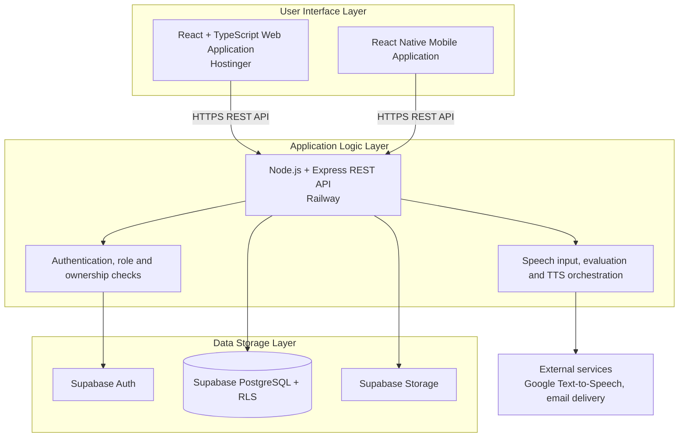

### Architecture description

The user interface layer presents the student, parent, teacher, and administrator dashboards. It collects input and displays results, but it does not contain service-role credentials and does not decide authorization. The application logic layer validates input, verifies bearer tokens, applies role and ownership rules, handles learning workflows, and returns safe API responses. The data storage layer persists identities, curriculum, practice results, progress, notifications, and files. RLS provides database-level isolation in addition to API authorization.

| Technology | Actual use in LinawLetra |
| --- | --- |
| React.js + TypeScript | Browser-based role dashboards and public pages |
| React Native | Mobile student/parent experience |
| Node.js + Express.js | REST API, authorization, validation, server workflows |
| Supabase | Auth, PostgreSQL database, RLS, RPCs, storage |
| MongoDB | Not used |
| Speech recognition/evaluation | Browser/mobile speech input plus practice-evaluation workflows; server-authoritative pilot is documented separately |
| Text-to-speech | Authenticated Google Cloud Text-to-Speech integration |
| External services | Google TTS, transactional email provider, Hostinger, Railway, Supabase |

## 2. Complete use-case diagram

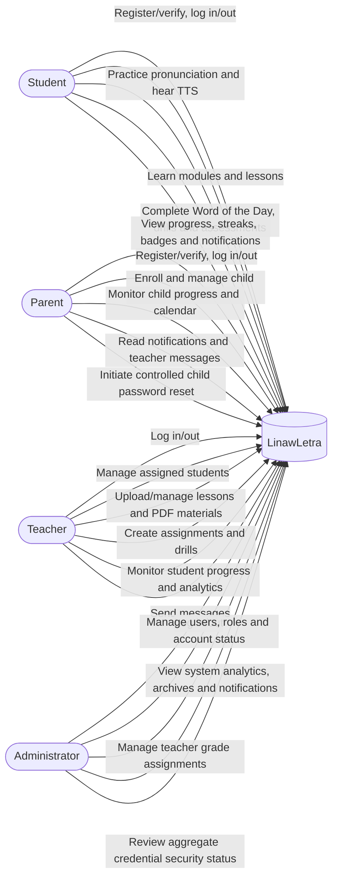

### Use-case descriptions

| Actor | Major functions |
| --- | --- |
| Student | Authenticates, uses modules/lessons, submits pronunciation practice, views feedback and progression, receives notifications. |
| Parent | Enrolls children, views individual progress, calendar and messages, and performs controlled credential-reset requests. |
| Teacher | Manages roster relationships, materials, lessons, PDF drills, assignments, progress reports, and communications. |
| Administrator | Manages accounts and teacher assignments, views aggregate reporting, archives/restores accounts, and receives system notices. |

## 3. Activity diagrams

### Complete web-system activity diagram

The following consolidated activity diagram presents the principal dynamic workflow of the deployed LinawLetra web application. The swimlanes distinguish actions initiated by a user, interface processing, protected API processing, and persistence or external-service work. The role workspaces are intentionally grouped after authentication so that the diagram remains readable while still showing the implemented Admin, Teacher, Parent, and Student pathways.

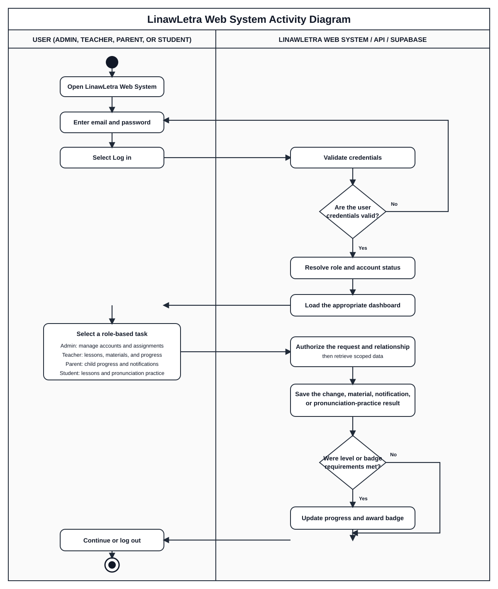

```mermaid
flowchart LR
  start((Start)) --> open[User opens LinawLetra web system]

  subgraph USER[User: public, Admin, Teacher, Parent, or Student]
    direction TB
    choose{Existing account?}
    register[Enter registration information]
    otp[Enter received OTP]
    login[Enter email and password]
    forgot[Request password reset]
    reset[Set a new password through verified reset flow]
    retry[Correct information and try again]
    select[Choose a dashboard action]
    logout[Select Log out]
  end

  subgraph WEB[Web System: React web interface]
    direction TB
    registrationForm[Validate registration fields]
    otpForm[Display OTP verification screen]
    loginForm[Submit credentials securely]
    error[Show safe validation or authentication error]
    route[Load role-appropriate dashboard]
    adminUI[Admin: manage users, roles, account status, grade assignments, analytics, archives and notices]
    teacherUI[Teacher: manage roster, lessons, assignments, PDF materials, progress and messages]
    parentUI[Parent: enroll/manage linked child, review progress, calendar, messages and notifications]
    studentUI[Student: browse lessons, activities, Word of the Day and practice]
    lesson[Open target word, sentence, lesson or activity]
    listen[Optionally request text-to-speech]
    speak[Provide microphone/speech input]
    feedback[Display score, feedback, hints, progress and earned rewards]
    continue{Continue another activity?}
  end

  subgraph API[Backend / REST API: Node.js and Express]
    direction TB
    pending[Create pending verification session]
    verifyOTP[Verify OTP validity and expiry]
    auth[Authenticate session and resolve role/account status]
    authorize[Authorize requested role, ownership and relationship]
    manage[Validate and apply permitted management request]
    practice[Validate student, activity and speech/practice payload]
    evaluate[Evaluate the submitted practice response]
    update[Apply completion, level and badge rules]
    signout[Invalidate/clear authenticated session]
  end

  subgraph DATA[Supabase / external services]
    direction TB
    email[Email delivery service sends OTP or reset link]
    supaAuth[(Supabase Authentication)]
    db[(PostgreSQL with RLS)]
    storage[(Supabase Storage)]
    tts[Google Cloud Text-to-Speech]
    notify[Create scoped notification when applicable]
  end

  open --> choose
  choose -- No --> register --> registrationForm --> pending --> supaAuth
  pending --> email --> otpForm --> otp --> verifyOTP
  verifyOTP --> validOTP{OTP valid and active?}
  validOTP -- No --> error --> retry
  retry --> register
  validOTP -- Yes --> account[Complete account registration] --> login
  choose -- Yes --> login
  login --> loginForm --> auth --> supaAuth
  auth --> validLogin{Credentials valid?}
  validLogin -- No --> error --> login
  login --> forgot --> email --> reset --> login
  validLogin -- Yes --> active{Account active and role recognized?}
  active -- No --> error --> login
  active -- Yes --> route --> select

  select --> adminUI --> authorize --> manage --> db --> route
  manage --> notify --> db
  select --> teacherUI --> authorize --> manage
  teacherUI --> upload{Upload or manage material?}
  upload -- Yes --> storage --> db
  upload -- No --> db
  select --> parentUI --> authorize --> db --> route
  select --> studentUI --> lesson
  lesson --> listen --> tts --> speak
  lesson --> speak
  speak --> practice --> authorize --> evaluate --> db
  evaluate --> result{Required score achieved?}
  result -- No --> feedback --> retryPractice{Practice again?}
  retryPractice -- Yes --> lesson
  retryPractice -- No --> route
  result -- Yes --> update --> db
  update --> nextLevel{Next-level requirements met?}
  nextLevel -- Yes --> unlock[Unlock eligible level or activity] --> db
  nextLevel -- No --> badges{Badge requirements met?}
  unlock --> badges
  badges -- Yes --> award[Create eligible badge award and XP] --> db
  badges -- No --> feedback
  award --> feedback --> continue
  continue -- Yes --> studentUI
  continue -- No --> route
  route --> logout --> signout --> supaAuth --> finish((End))
```

#### Activity diagram explanation

The Web System Activity Diagram illustrates the dynamic workflow of the LinawLetra web application. A user can register through the OTP verification flow, sign in, recover credentials through the verified reset flow, and be routed according to the resolved account role. After the role and relationship checks, administrators manage authorized user and assignment records; teachers manage materials and monitor their assigned learners; parents access only linked-child information; and students select learning activities and submit pronunciation practice. The system validates each request, stores only authorized data through Supabase, optionally requests text-to-speech, evaluates practice results, updates progression, and awards eligible badges without duplication. Error, retry, authorization, performance, progression, and logout paths are explicitly represented.

### Registration and OTP verification

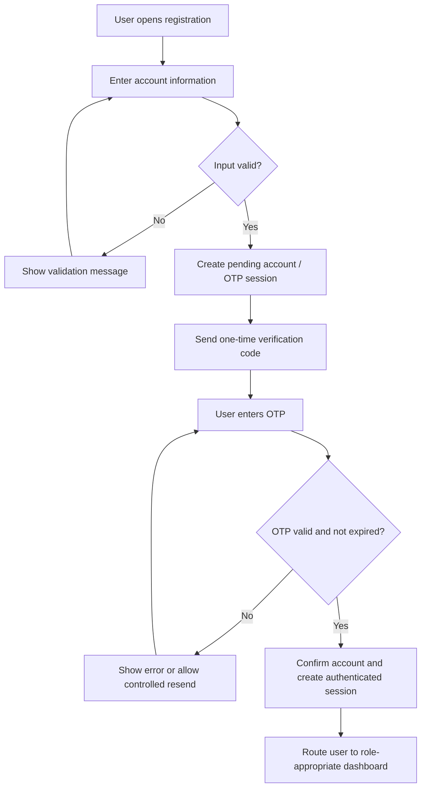

### Login and logout

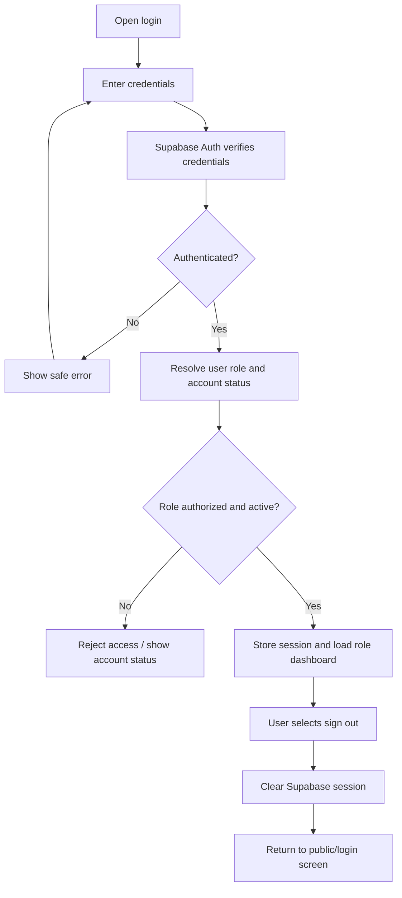

### Student pronunciation practice

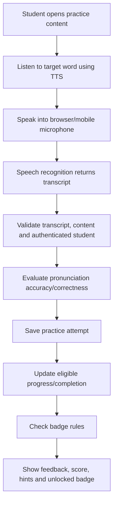

### Level progression and badge unlocking

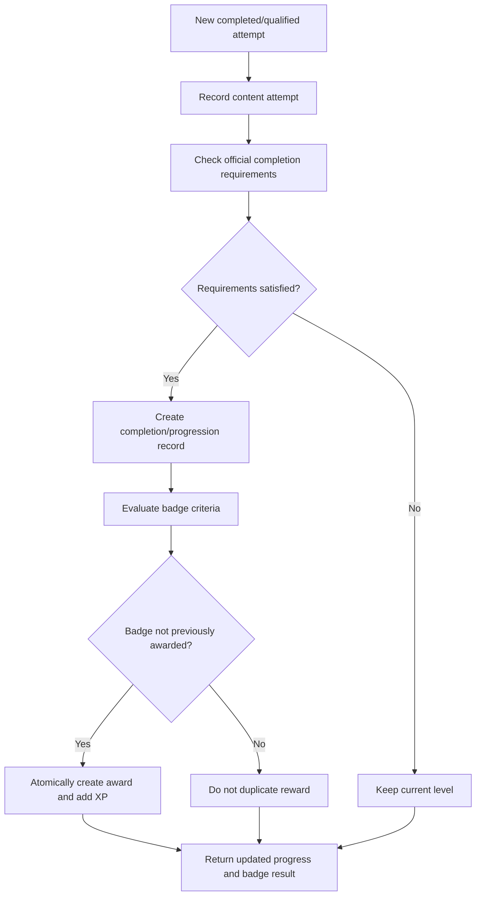

### Teacher material upload and management

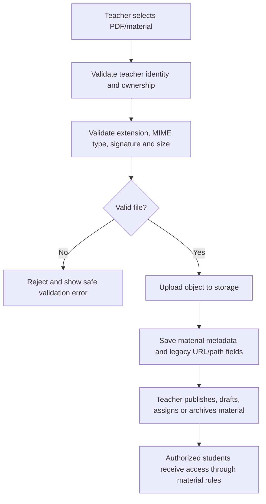

### Teacher and parent progress monitoring

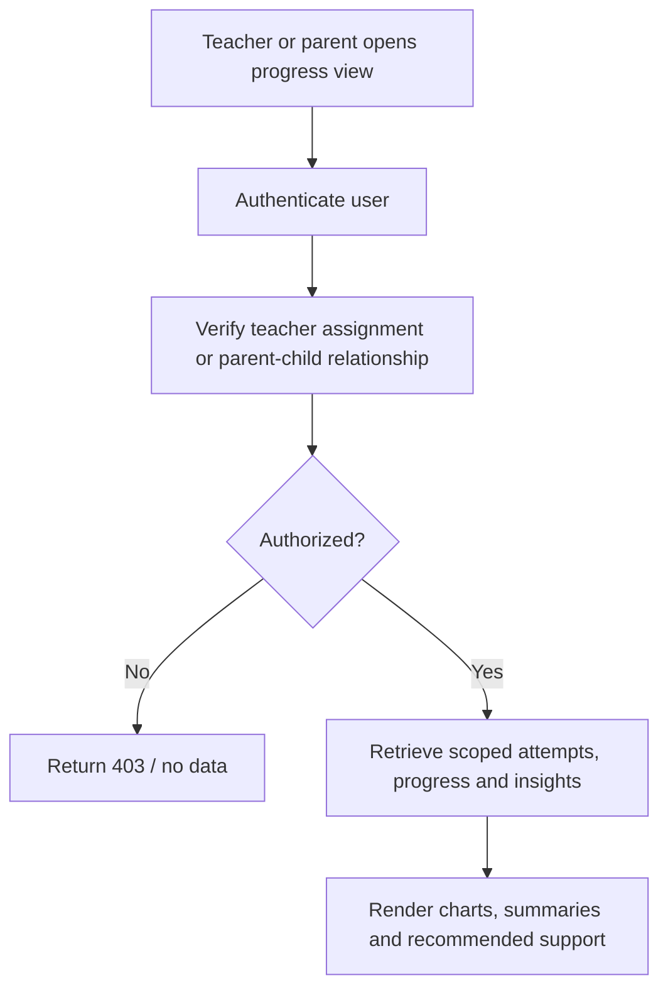

### Notifications and admin user management

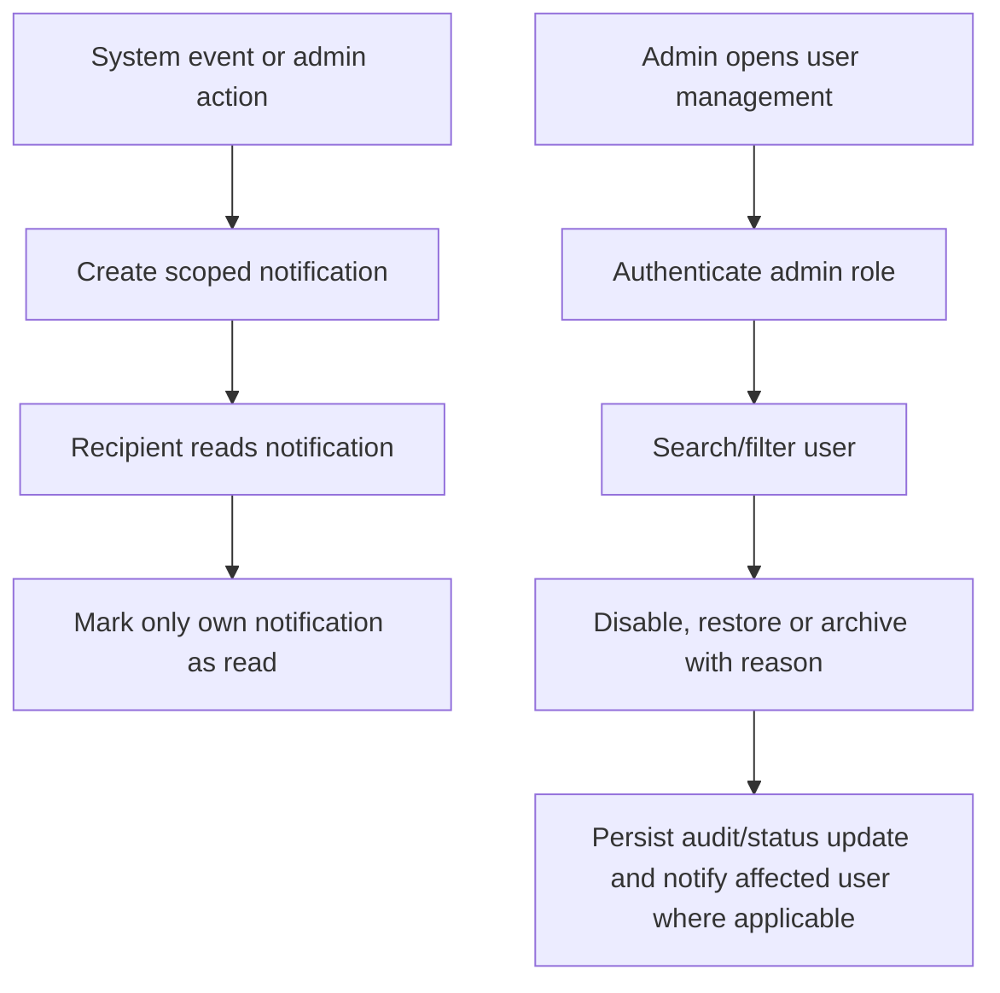

## 4. Entity relationship diagram

The diagram focuses on principal entities observed in the available schema. Some historical mobile migrations contain compatibility tables; the deployed Supabase schema and [RLS audit](RLS_AUDIT.md) remain the authoritative operational reference.

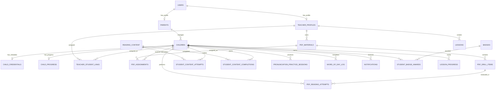

### Database/ERD explanation

`users` is the platform account identity, while `parents` and `teacher_profiles` provide role-specific profile information. `children` represents student records, links to a parent, and is associated with progress and optional credential metadata. Teacher-student links scope roster access. Learning is represented through reading content, attempts, completions, modules, lessons, PDF materials, assignments, drills, and pronunciation sessions. Badge awards are separated into a uniqueness-protected award table to prevent duplicate rewards. Notifications are scoped to their recipient.

Important supporting tables include `reading_modules`, `reading_module_items`, `reading_module_assessments`, `student_module_assessment_attempts`, `student_module_assessment_responses`, `student_module_completions`, `lesson_progress`, `phoneme_confusion`, `student_nonsense_checks`, `teacher_messages`, `scheduled_activities`, `word_definitions`, `words`, and settings tables. No raw password value belongs in the ERD output or documentation.

## 5. Sequence diagrams

### Registration and OTP verification

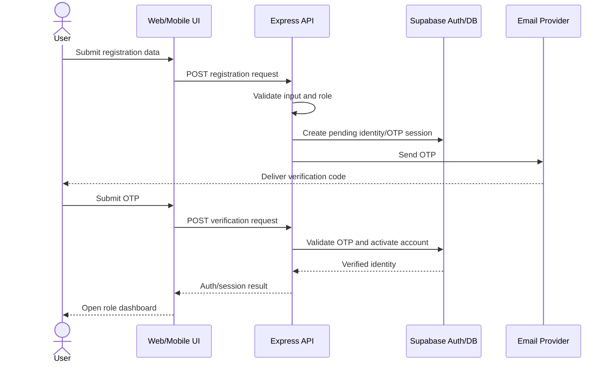

### Login

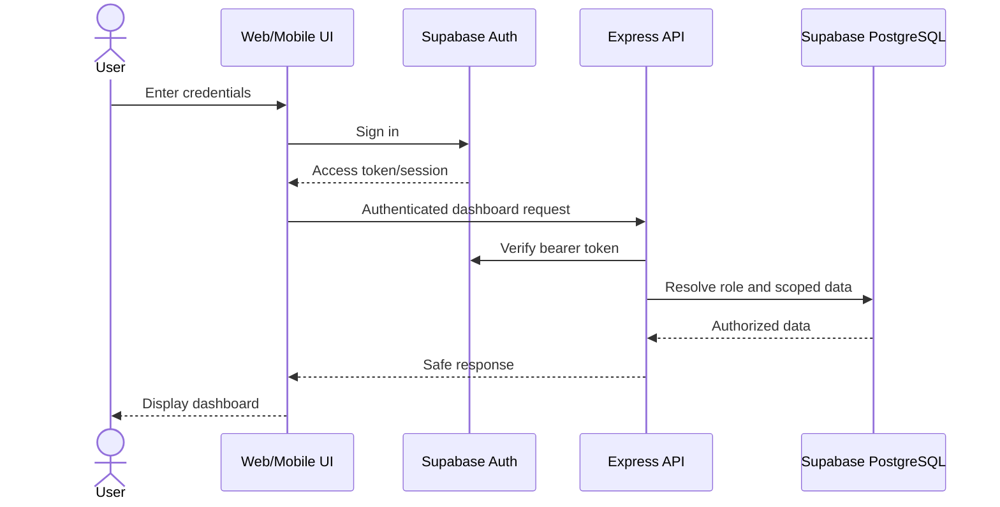

### Pronunciation practice, progress and badge award

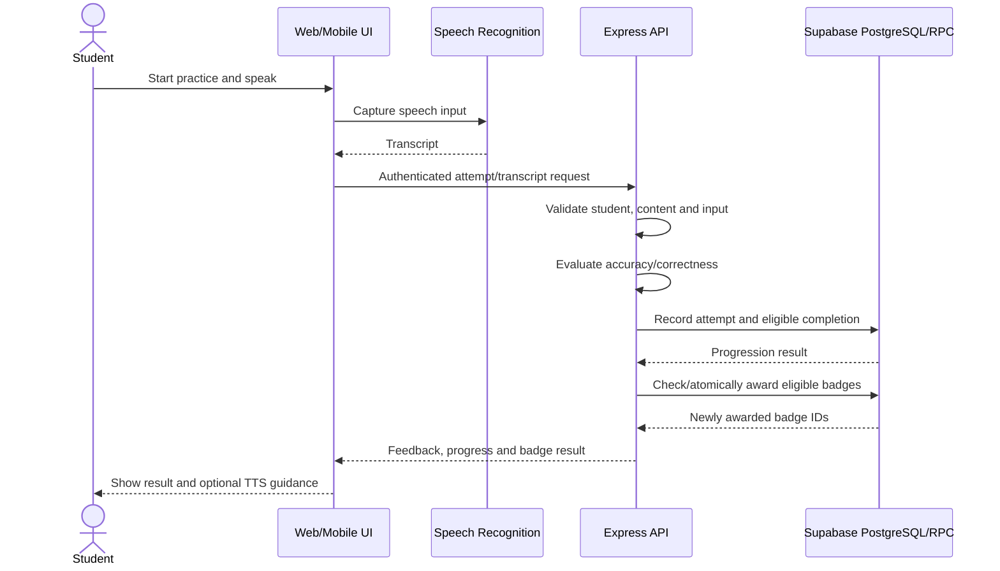

### Teacher material upload

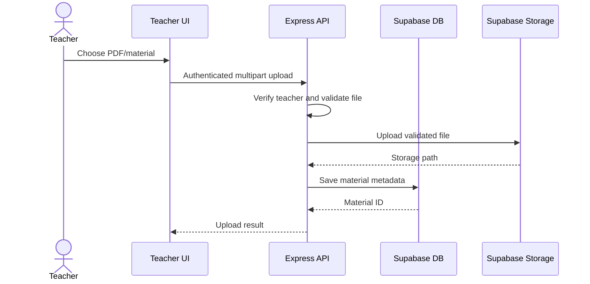

### Parent monitoring

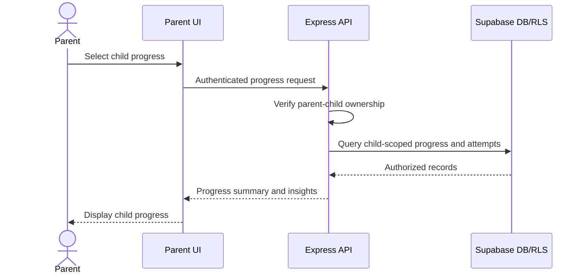

## 6. Deployment diagram

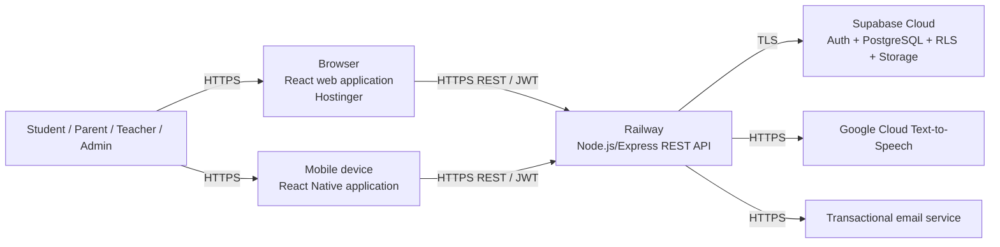

### Deployment architecture explanation

The production web bundle is deployed to Hostinger and accessed through `linawletra.com`. The Express API is deployed to Railway and exposes authenticated HTTPS endpoints. Supabase hosts Auth, PostgreSQL, RLS policies, RPCs, and storage. The web and mobile clients communicate through the internet using HTTPS; service-role keys stay only in Railway/server environments. Google Cloud Text-to-Speech and the transactional email provider are external services called by the backend. CORS restricts browser origins, and security headers are applied at the API and Hostinger layers.

## 7. Diagram interpretation notes

- Activity diagrams describe business flow and decision points.
- Sequence diagrams describe message order among actors and services.
- The ERD describes data relationships, not every field or historical compatibility artifact.
- The deployment diagram describes physical/cloud hosting and network communication.
- RLS policies, API authorization, and backend validation work together; no single diagram replaces live security testing.
